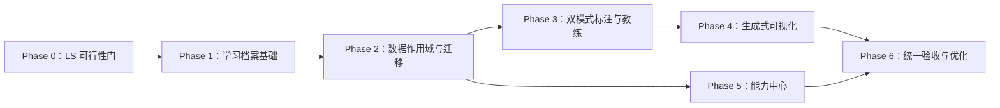

# 标注星图四项升级实施计划

日期：2026-08-13

关联设计：

- `docs/superpowers/specs/2026-08-12-learning-profiles-label-studio-sso-design.md`
- `docs/superpowers/specs/2026-08-13-generative-visualization-design.md`
- `docs/superpowers/specs/2026-08-13-capability-center-onboarding-design.md`
- `docs/superpowers/specs/2026-08-13-annotation-coach-character-design.md`

## 1. 实施原则

1. 先验证 Label Studio 1.23.0 的高风险接入边界，再承诺隐藏身份与无感进入。
2. 先建立学习档案的数据作用域，再迁移聊天、记忆、学习记录和标注数据。
3. 不修改 Label Studio 认证源码；不把失败方案降级为所有学生共用同一网页身份。
4. `learning_profile_id` 专指学生学习档案，禁止复用现有代表模型配置的 `profile_id`。
5. 学生浏览器不得获得 PIN 哈希、Label Studio 服务 Token 或隐藏身份凭证。
6. 新能力保持可降级：Label Studio、子 Agent、生图或扩展故障不阻断核心教学模式。
7. 每个阶段独立测试、提交；只精确暂存相关文件，不处理用户保留的未跟踪素材。

## 2. 交付顺序



教练母图已经作为独立资产完成，不阻塞其他阶段。

## 3. Phase 0：Label Studio 1.23.0 可行性门

### 目标

用当前本地安装的 Label Studio 1.23.0 验证社区版是否能稳定支持：隐藏用户、任务归属、受控网页会话、指定任务跳转和服务账号 API。只做隔离实验，不改正式数据。

### 任务

1. 新建 `scripts/label_studio_capability_probe.py`：
   - 读取环境变量中的 URL 和服务 Token；
   - 探测版本、认证方式、项目/任务/标注 API；
   - 探测用户创建与项目成员权限是否有稳定 API；
   - 输出脱敏 JSON 报告，不打印秘密值。
2. 在临时数据目录启动独立 Label Studio 实例进行实验，不使用 `data/label-studio/` 正式目录。
3. 验证以下场景：
   - 服务账号创建项目与导入任务；
   - 两个隐藏身份分别提交标注且 annotator 可追溯；
   - 身份 A 无法访问身份 B 未分配任务；
   - 从标注星图入口建立网页会话并直达指定任务；
   - iframe Cookie、SameSite、CSRF 和退出行为。
4. 写入 `docs/label-studio-1.23-capability-report.md`：支持、受限、不支持及证据。

### 决策门

- 全部关键能力稳定：进入 Phase 1，并按隐藏身份混合架构实施。
- 用户级细分权限不足，但可用“每档案独立项目 + 路由白名单”可靠隔离：记录成本后继续。
- 无法可靠隔离网页身份：停止专业模式 SSO 实施，保留当前登录方式并向用户报告，不创建共享身份假象。

### 测试

- `tests/integration/test_label_studio_capability_probe.py`
- 探测脚本离线单测使用 mock，不要求 CI 启动 Label Studio。
- 本地集成测试显式标记 `integration`。

## 4. Phase 1：学习档案、PIN 与授权会话

### 后端模块

新增：

- `deeptutor/services/learning_profiles/models.py`
- `deeptutor/services/learning_profiles/store.py`
- `deeptutor/services/learning_profiles/pin.py`
- `deeptutor/services/learning_profiles/grants.py`
- `deeptutor/services/learning_profiles/audit.py`
- `deeptutor/api/routers/learning_profiles.py`

核心对象：

- `LearningProfile`
- `ProfileGrant`
- `ProfileAuditEvent`
- `ProfileAccessContext`

### 安全规则

1. PIN 使用项目现有密码哈希库或等价强哈希，不自创加密算法。
2. 记录失败次数与冻结到期时间；冻结策略作为常量集中配置。
3. 档案授权使用服务端可撤销会话，HttpOnly Cookie 只携带随机会话标识。
4. 服务端以最后活动时间计算 30 分钟闲置过期；前端计时只负责提示。
5. 关闭浏览器、退出账号、手动锁定调用撤销接口。
6. 教师只读上下文与学生授权上下文分开；代管模式使用单独、短期、可审计授权。

### API

- `GET /api/v1/learning-profiles`
- `POST /api/v1/learning-profiles`
- `PATCH /api/v1/learning-profiles/{id}`
- `POST /api/v1/learning-profiles/{id}/unlock`
- `POST /api/v1/learning-profiles/lock`
- `POST /api/v1/learning-profiles/{id}/pin/change`
- `POST /api/v1/learning-profiles/{id}/pin/reset`
- `POST /api/v1/learning-profiles/{id}/teacher-view`
- `POST /api/v1/learning-profiles/{id}/impersonate`
- `GET /api/v1/learning-profiles/active`

### 前端

新增：

- `web/components/learning-profiles/ProfileSwitcher.tsx`
- `web/components/learning-profiles/ProfileUnlockDialog.tsx`
- `web/components/learning-profiles/ProfileLockBanner.tsx`
- `web/lib/learning-profiles-api.ts`

在 workspace 布局顶部展示当前档案与锁定入口。锁定后关闭主聊天发送、标注任务、记忆和教练入口。

### 测试

- `tests/services/test_learning_profiles.py`
- `tests/api/test_learning_profiles_router.py`
- 覆盖哈希、冻结、30 分钟过期、跨账号拒绝、教师只读、代管审计和撤销。
- 前端补 ProfileSwitcher 和解锁对话框组件测试。

## 5. Phase 2：档案数据作用域与历史迁移

### 路径设计

在账号级用户根目录下建立：

```text
workspace/learning_profiles/<learning_profile_id>/
├── sessions/
├── memory/
├── learning/
├── annotation/
├── artifacts/
└── inbox/
```

公共题库、课程素材、账号级 Skill/MCP/模型配置继续留在账号作用域。

### 代码改造

1. 扩展 `deeptutor/multi_user/context.py`，增加请求级当前学习档案 ContextVar。
2. 扩展 `deeptutor/multi_user/paths.py` 与 `deeptutor/services/path_service.py`，提供档案作用域路径服务。
3. 修改 HTTP 与 WebSocket 认证入口，在账号认证后安装经过验证的档案上下文。
4. 迁移以下调用者到档案路径：
   - `services/session/`
   - `services/memory/`
   - `services/learning_records.py`
   - `services/learning_workspace.py`
   - `services/knowledge_graph.py`
   - 课程计划、决策日志、学习报告和标注草稿。
5. 保持模型配置、MCP、Skill 和公共 KB 使用账号路径，避免误迁移。

### 迁移器

新增 `deeptutor/services/learning_profiles/migration.py` 和管理员命令：

- 自动创建“原有学习档案”；
- 清点会话、记忆、学习记录、错题与标注结果；
- 先复制到档案目录并生成计数/哈希报告；
- 验证成功后切换读取标记；
- 保留可恢复备份，不静默删除原数据；
- 可重复执行且不会重复导入。

### 测试

- `tests/services/test_learning_profile_paths.py`
- `tests/services/test_learning_profile_migration.py`
- `tests/api/test_learning_profile_context.py`
- 两个档案并行写会话、记忆、学习记录后互不可见。
- 旧数据迁移前后计数与样本内容一致。

## 6. Phase 3：双模式标注、Label Studio 与教练上下文

### 3A：统一标注记录与草稿

新增：

- `deeptutor/services/annotation_attempts/models.py`
- `deeptutor/services/annotation_attempts/store.py`
- `deeptutor/services/annotation_attempts/sync_queue.py`
- 草稿、提交、版本、评分、同步状态 API。

修改：

- `deeptutor/api/routers/annotation.py`
- `web/app/(workspace)/annotation/page.tsx`
- `web/public/annotation_tool*.html`（过渡期只增加后端保存桥接）

现有 localStorage 降级为断网缓存，服务端记录成为唯一事实来源。提交使用幂等 ID，避免同步重试产生重复标注。

### 3B：Label Studio 接入网关

新增：

- `deeptutor/services/label_studio_gateway/client.py`
- `identity_map.py`
- `session_bridge.py`
- `task_access.py`
- `sync.py`
- `deeptutor/api/routers/label_studio_gateway.py`

要求：

- 复用官方 API；服务 Token 只在后端。
- 按 Phase 0 报告选择“每档案身份”或“每档案独立项目”隔离策略。
- 专业模式直达被分配任务，并提供本人任务列表。
- 后端白名单拒绝管理页、其他项目和未分配任务。
- Label Studio 不可用时不影响教学模式。
- 移除未使用的 `label-studio-frontend@1.7.1` 依赖并验证构建。

### 3C：标注教练上下文聚合

新增：

- `deeptutor/services/coach_context/service.py`
- `deeptutor/services/coach_context/models.py`
- `deeptutor/tools/coach_context_tool.py`

默认摘要包含当前任务、模式、已保存草稿概况、最近评分、确认薄弱点和学习偏好；详细历史、记忆、错题和 LS 结果通过受控按需工具读取。

修改 `web/components/annotation/AnnotationCoach.tsx`：

- 发送当前任务和模式的非权威提示，后端重新验证并构建上下文；
- 档案锁定/切换时断开旧教练会话并清空缓存；
- 教学模式与专业模式均由外层宿主显示同一教练；
- 使用 `/coach/coach-master.png` 替换 `🤖`，保留拖动和独立会话。

第一期读取已保存状态。Label Studio 未保存操作事件桥接放入 Phase 6，不在此阶段侵入其源码。

### 测试

- `tests/services/test_annotation_attempt_store.py`
- `tests/services/test_annotation_sync_queue.py`
- `tests/services/test_label_studio_gateway.py`
- `tests/services/test_coach_context.py`
- `tests/api/test_annotation_profile_isolation.py`
- 前端 E2E：教学/专业切换、教练显示、锁定、保存草稿和服务不可用降级。

## 7. Phase 4：共享生成式可视化

### 协议与存储

新增：

- `deeptutor/services/visualization/models.py`
- `router.py`
- `validation.py`
- `artifact_store.py`
- `deeptutor/api/routers/visualization.py`

实现统一 `VisualizationArtifact`，兼容已有 chart metadata。

### 内置子 Agent

扩展现有 `delegate_to_expert` 的受限委派机制，但与六个教学专家分组注册：

- `chart_expert`
- `diagram_expert`
- `image_expert`

专家卡放入独立 skill/reference 目录；各专家只获得必要工具和数据。禁止把外接 Codex/Claude CLI 作为产品图表生成的必要依赖。

### 工具

- `create_chart`：结构化真实数据 → Chart.js 协议。
- `create_diagram`：Mermaid/SVG/受控 HTML。
- `generate_learning_image`：调用账号当前默认或临时选择的生图模型。
- `get_visualization_source`：返回脱敏原始数据与来源。
- `rerender_visualization`：保持数据不变，更换合法图形。

数字图表先做确定性校验；复杂图才增加模型检查。

### 前端

新增：

- `web/components/visualization/VisualizationArtifactCard.tsx`
- `ArtifactToolbar.tsx`
- `SourceDataDialog.tsx`
- `VisualizationProgress.tsx`

支持内嵌、全屏、PNG 下载、查看来源、“换一种图”、保存为会话作品和加入学习资料。图表组件动态加载。

### 接入

- 主聊天：主 Agent 调度。
- 标注页：标注教练调度。
- 知识库问答：保留引用。
- 学习报告：只允许校验通过的图表/图解。

### 测试

- `tests/services/test_visualization_validation.py`
- `tests/services/test_visualization_artifacts.py`
- `tests/tools/test_visualization_tools.py`
- 数据不足不得产生数字图；换图不得修改源数据；无生图模型时正确降级。
- 前端测试 Chart.js 实例销毁，防止再次出现 canvas 重用错误。

## 8. Phase 5：初始化向导与能力中心

### 统一状态服务

新增：

- `deeptutor/services/capability_center/status.py`
- `health.py`
- `diagnostics.py`
- `onboarding.py`
- `deeptutor/api/routers/capability_center.py`

聚合现有模型、知识库、MCP、Skill、学习插件、Label Studio 和系统状态，不重写各服务底层实现。

### 前端入口

新增：

- `web/app/(utility)/setup/page.tsx`
- `web/app/(utility)/capabilities/page.tsx`
- `web/components/capability-center/`

卡片区域：模型能力、知识与资料、扩展市场、标注服务、系统体检。原高级设置页保留并从卡片跳转。

### 知识库导入向导

在现有知识 API 上增加可恢复 job 协议：

- 文件清单与重复检测；
- 自动解析策略；
- 分文件状态与修复动作；
- 解析/索引进度；
- 示例问题及引用测试；
- 中断后继续。

### 扩展市场

在现有受控学习扩展和 Skill Hub/MCP API 上增加统一只读目录与健康状态。默认只允许白名单；开发者模式、自定义来源、安全检查和审计作为管理员高级路径。

### 模型配置

复用 `ServiceConfigEditor` 和 provider registry，新增向导视图：提供商、密钥/OAuth、模型同步、用途选择、能力测试、默认模型。秘密值不回显。

### 一键体检

输出正常/受限/故障、影响范围和修复链接。下载报告使用严格白名单字段，不做“先输出再正则脱敏”。

### 测试

- `tests/services/test_capability_center_health.py`
- `tests/services/test_diagnostics_redaction.py`
- `tests/api/test_capability_center_router.py`
- 前端 E2E：首次向导、跳过可选项、导入失败修复、权限限制和高级设置跳转。

## 9. Phase 6：统一验收、实时桥接与性能

### 安全验收

- 两个账号、每个账号两个档案，执行 URL/API/WS 越权矩阵。
- PIN、Token、Cookie、隐藏身份凭证不出现在响应、日志、诊断或模型上下文。
- 教师只读不产生学生写记录；代管操作全部可审计。

### Label Studio 实时桥接

仅在 Phase 0 证明存在可替换、低侵入事件接入点时实施：

- 当前框数量；
- 当前标签；
- 保存、撤销、切题等最小事件。

不传原始鼠标轨迹，不直接修改 Label Studio 核心认证与数据模型。无法稳定实现则保留已保存状态读取，并在产品中明确说明。

### 性能

- 记录关键页面首屏、JS 包体、API 延迟和聊天首 token 基线。
- 可视化、能力中心和管理组件动态加载。
- 拆分本阶段实际触及的超大文件，不做无关全仓重构。
- 对档案摘要和健康状态设置短缓存，档案切换时精确失效。

### 最终验证

- 后端聚焦测试后运行可行范围全量 `pytest`，记录预存在失败。
- `cd web && npx tsc --noEmit`
- `cd web && npm run build` 或项目等价构建命令。
- Playwright 覆盖初始化、档案切换、教学标注、专业标注、教练、图表和故障降级主流程。

## 10. 提交建议

按以下独立提交，便于回滚：

1. `test: 探测 Label Studio 单点接入能力`
2. `feat: 增加学习档案与 PIN 授权`
3. `feat: 隔离学习档案数据并迁移历史`
4. `feat: 统一标注草稿与 Label Studio 网关`
5. `feat: 打通标注教练上下文与品牌头像`
6. `feat: 增加共享生成式可视化子 Agent`
7. `feat: 增加初始化向导与能力中心`
8. `test: 完成平台升级端到端验收`

## 11. 首个实施批次

下一步只启动 Phase 0，原因是 Label Studio 社区版的隐藏用户和网页会话能力是最大不确定项。Phase 0 不修改正式数据，也不阻止随后并行准备学习档案模型。完成能力报告后，再锁定 Phase 3B 的具体身份策略。

## 12. 实施结果（2026-08-13）

本计划已按推荐方案完成主路径实施：

| 阶段 | 状态 | 关键结果 | 提交 |
|---|---|---|---|
| Phase 0 | 完成 | 对 Label Studio 1.23 做隔离探测，采用“每档案独立项目 + 服务端白名单 + 隐藏网页会话” | `7367191d` |
| Phase 1–2 | 完成 | 多学习档案、PIN、授权 Grant、审计、历史数据迁移与路径隔离 | `57efb77a` |
| Phase 3 | 完成 | 教学/专业标注统一草稿与提交、LS 同源网关、教练实时上下文和 annotation-id 归属复核 | `278dbf33`、`b288188d` |
| Phase 4 | 完成 | 可信 VisualizationArtifact、Chart.js/Mermaid/图片卡片、三名可视化专职子 Agent | `26d9c3c6` |
| Phase 5 | 完成 | `/capabilities`、七步初始化、资料快速导入、模型/Skill/MCP/LS/系统体检和脱敏报告 | `b288188d` |
| Phase 6 | 完成主路径 | 学习数据滚动、标注教练与数据标签按需加载、生产构建、gzip 包体预算和浏览器冒烟 | `3283d7b1` |

已验证：

- 后端定向测试与 Ruff 通过；能力中心和 LS 策略新增 6 项测试通过。
- `npx tsc --noEmit`、改动文件 ESLint、Next 生产构建通过，46 个静态页面生成成功。
- gzip 性能预算：公共外壳 141KB，标注页 41KB，学习数据页 42KB，均通过门禁。
- Playwright 可见浏览器验收覆盖能力中心、学习档案锁、学习数据滚动、标注教练头像与专业模式入口；未再出现 Chart.js Canvas 重用异常。

仍需部署环境完成的外部配置不是代码缺口：在正式 Label Studio 中生成 `LABEL_STUDIO_API_TOKEN`，设置独立 `LABEL_STUDIO_BRIDGE_SECRET`，再用两个真实账号、每账号两个学习档案执行完整越权矩阵。未配置或 LS 未启动时，教学标注台按设计继续可用。
