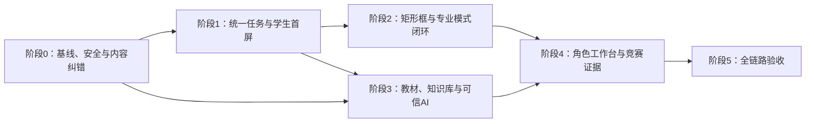

# 标注星图竞赛就绪纵向优化实施计划

日期：2026-08-14

关联设计：

- `docs/superpowers/specs/2026-08-13-competition-readiness-vertical-optimization-design.md`
- `docs/superpowers/specs/2026-08-14-competition-optimization-design-index.md`
- `docs/superpowers/specs/2026-08-14-deterministic-dialogue-progressive-answer-design.md`
- `docs/superpowers/specs/2026-08-14-trusted-visualization-evaluation-design.md`
- `docs/superpowers/specs/2026-08-14-profile-authorization-impersonation-audit-design.md`
- `docs/superpowers/specs/2026-08-14-role-workspaces-onboarding-extension-design.md`
- `docs/superpowers/specs/2026-08-14-user-testing-competition-evidence-design.md`
- `docs/superpowers/specs/2026-08-14-release-readiness-gates-design.md`
- `docs/superpowers/handoffs/2026-08-14-competition-optimization-ai-handoff.md`

交接说明：上述专项规格已经把任务 3.4 至 5.3 的产品边界、数据契约、权限、失败处理和验收条件固定下来。接手者应以设计索引规定的事实优先级执行，不应只根据本计划中的简表自行扩展范围。

当前进度：阶段 0 的工程基础、阶段 1、阶段 2 以及任务 3.1 至 3.3 已有提交；任务 0.4 仍需要人工专业终审。后续代码执行从任务 3.4 开始，详细状态以 AI 执行交接书和当前 Git 历史为准。

## 1. 实施原则

1. 保持 Next.js、FastAPI 与 Label Studio 1.23 的现有架构，不引入 Redis、消息队列或微服务。
2. 沿学生主路径逐段交付，每个任务独立测试、精确暂存、独立提交。
3. 复用现有学习档案、标注草稿、Label Studio 网关、教练上下文、可信可视化和能力中心，不创建第二套同类系统。
4. 所有学生私有数据继续通过账号与学习档案路径服务解析；缓存、草稿、指标和评测也必须隔离。
5. 先写失败测试或可重复基线，再修改实现；阶段验收未通过不进入依赖它的下一阶段。
6. 专业内容由 AI 初审、人工终审；任何自动生成内容不得直接发布或参与正式评分。
7. 用户未跟踪文件不暂存、不删除、不移动；`docs/` 和必要的受控数据清单使用精确 `git add -f`。

## 2. 总体依赖顺序



## 3. 阶段0：基线、安全与内容纠错

### 任务0.1：建立可重复的性能基线

目标：在优化前得到真实基线，避免只凭主观判断“变快了”。

新增：

- `deeptutor/services/performance_metrics/models.py`
- `deeptutor/services/performance_metrics/store.py`
- `deeptutor/api/routers/performance_metrics.py`
- `web/lib/performance-metrics.ts`
- `tests/services/test_performance_metrics.py`
- `tests/api/test_performance_metrics_router.py`
- `web/tests/performance-metrics.test.ts`
- `scripts/measure_student_journey.py`

修改：

- `deeptutor/api/main.py`：注册受控指标路由。
- `web/app/(workspace)/layout.tsx`：记录页面可操作和切换耗时。
- `web/app/(workspace)/home/[[...sessionId]]/page.tsx`：记录发送状态与首字时间。
- `web/app/(workspace)/progress/page.tsx`：记录首屏核心信息完成时间。
- `web/app/(workspace)/annotation/page.tsx`：记录任务与模式切换时间。

实现要求：

1. 仅记录耗时、阶段、工具次数、取消、超时和错误类型。
2. 不记录对话正文、标注坐标、密钥、PIN、姓名和原始文件内容。
3. 指标键包含匿名账号散列、学习档案散列、路由和构建版本。
4. 提供开发环境导出接口；学生界面不展示原始指标。
5. 脚本输出冷启动、页面切换、成长首屏和聊天状态的 p50/p95。

验证：

```powershell
python -m pytest tests/services/test_performance_metrics.py tests/api/test_performance_metrics_router.py -q
cd web
node --test tests/performance-metrics.test.ts
```

提交：`feat: 建立学生主路径性能基线`

### 任务0.2：迁移密钥存储并完成轮换检查

目标：业务数据不再保存可回显的完整密钥。

新增：

- `deeptutor/services/secrets/models.py`
- `deeptutor/services/secrets/store.py`
- `deeptutor/services/secrets/redaction.py`
- `tests/services/test_secret_store.py`
- `tests/security/test_secret_redaction.py`

修改：

- `deeptutor/api/routers/settings.py`
- `deeptutor/api/routers/capabilities_settings.py`
- `deeptutor/services/config/runtime_settings.py`
- `web/components/settings/SettingsContext.tsx`
- `web/components/settings/SettingsStatusPanel.tsx`

实现要求：

1. Windows 优先使用系统凭据库；其他环境支持环境变量引用。
2. 数据文件只保存 `secret_ref`，API 只返回是否已配置和掩码。
3. 连接测试在后端解析密钥，日志和异常统一脱敏。
4. 提供只读迁移检查，不自动删除旧配置；管理员确认后完成迁移和旧密钥轮换。
5. 现有真实密钥不得进入测试快照、提交记录或诊断文件。

验证：

```powershell
python -m pytest tests/services/test_secret_store.py tests/security/test_secret_redaction.py tests/multi_user/test_settings_status_redaction.py -q
```

提交：`security: 迁移模型密钥并统一脱敏`

### 任务0.3：建立专业内容来源与审核模型

目标：国家标准、教材、官方文档、论文和项目经验可以明确区分并追溯。

新增：

- `deeptutor/services/content_governance/models.py`
- `deeptutor/services/content_governance/store.py`
- `deeptutor/services/content_governance/review.py`
- `deeptutor/services/content_governance/versioning.py`
- `deeptutor/api/routers/content_governance.py`
- `tests/services/test_content_governance.py`
- `tests/api/test_content_governance_router.py`
- `scripts/audit_annotation_sources.py`

核心对象：

- `SourceRecord`
- `ContentRevision`
- `ReviewDecision`
- `StandardConflict`
- `HistoricalImpact`

实现要求：

1. 来源记录包含来源等级、标准号或 ISBN、版次、出版社、章节、页码、链接或文件哈希。
2. 项目经验必须标记为建议或示例阈值，不能显示为强制标准。
3. 发布内容必须有人工审核决定；AI 只能写入候选修订。
4. 修改题目或评分规则时发布新版本，保留旧答题和初次成绩。
5. 脚本首先报告 `GB/T 41867-2022` 等高风险引用位置，不执行盲目全局替换。

验证：

```powershell
python -m pytest tests/services/test_content_governance.py tests/api/test_content_governance_router.py -q
python scripts/audit_annotation_sources.py --check-only
```

提交：`feat: 增加专业内容来源与审核治理`

### 任务0.4：审校现有60篇资料和102道题

目标：把现有内容迁入审核模型，并完成高风险内容人工终审。

新增：

- `data/content-governance/source-catalog.json`
- `data/content-governance/review-manifest.json`
- `docs/content-audit/annotation-content-audit-report.md`

修改范围：

- `data/user/workspace/annotation_kb/*.md`
- `data/user/workspace/task_bank.json`
- `deeptutor/services/persona/presets/annotation-coach/PERSONA.md`
- `deeptutor/skills/builtin/annotation-guide/`
- 包含错误标准引用的工具提示和产品说明。

执行要求：

1. 生成逐条候选修订和来源缺口，不自动批准。
2. 优先处理标准名称、职业等级、评分阈值、安全规范和题目答案。
3. 无权威依据但有教学价值的内容降级为项目经验。
4. 人工审核后才更新正式内容，并记录审核人、时间和版本。
5. 受影响历史成绩仅生成影响清单，待版本化重算任务执行。

验证：

- 高风险标准误引为零；
- 正式题目均有可解析的来源记录或明确项目经验标签；
- 随机抽取不少于 20 道题人工复核答案、解析和来源一致性。

提交：`content: 修正标注知识与题库来源`

阶段0验收门：性能基线可重复；真实密钥不出现在接口和日志；高风险专业误引完成审校；内容版本可追溯。

## 4. 阶段1：统一当前任务与学生首屏

### 任务1.1：建立 CurrentLearningTask 服务

新增：

- `deeptutor/services/current_learning_task/models.py`
- `deeptutor/services/current_learning_task/store.py`
- `deeptutor/services/current_learning_task/service.py`
- `deeptutor/api/routers/current_learning_task.py`
- `tests/services/test_current_learning_task.py`
- `tests/api/test_current_learning_task_router.py`

修改：

- `deeptutor/services/learning_workspace.py`
- `deeptutor/services/annotation_attempts/store.py`
- `deeptutor/services/coach_context/service.py`
- `deeptutor/multi_user/context.py`
- `deeptutor/api/main.py`

实现要求：

1. 当前任务包含档案、课程、题目、阶段、模式、草稿、最近提交、教练会话、计时和版本引用。
2. 阶段转换使用白名单状态机，禁止模型任意跳转。
3. 写操作需要当前档案写权限、幂等键和期望版本。
4. 切换档案、任务或课程时清除不兼容的旧上下文。
5. 通过事件通知现有学习记录、教练和报告服务，不直接复制事实数据。

验证：

```powershell
python -m pytest tests/services/test_current_learning_task.py tests/api/test_current_learning_task_router.py tests/security/test_learning_profile_isolation_matrix.py -q
```

提交：`feat: 统一学生当前学习任务`

### 任务1.2：前端当前任务上下文和请求隔离

新增：

- `web/components/current-task/CurrentLearningTaskContext.tsx`
- `web/components/current-task/CurrentTaskBar.tsx`
- `web/lib/current-learning-task-api.ts`
- `web/lib/profile-scoped-request.ts`
- `web/tests/current-learning-task.test.ts`

修改：

- `web/app/(workspace)/layout.tsx`
- `web/components/learning-profiles/LearningProfileContext.tsx`
- `web/app/(workspace)/home/[[...sessionId]]/page.tsx`
- `web/app/(workspace)/annotation/page.tsx`
- `web/app/(workspace)/progress/page.tsx`
- `web/components/annotation/AnnotationCoach.tsx`

实现要求：

1. 四个学生入口共享同一个任务状态条。
2. 档案切换时使用 `AbortController` 取消旧请求并清理旧草稿视图。
3. 所有响应携带档案与任务版本，旧响应不得覆盖新状态。
4. 未提交输入、合理滚动位置和本档案草稿可恢复。

验证：

```powershell
cd web
node --test tests/current-learning-task.test.ts
npx tsc --noEmit
```

提交：`feat: 打通前端当前任务上下文`

### 任务1.3：学生四入口与首屏减负

新增：

- `web/components/student-shell/StudentNavigation.tsx`
- `web/components/student-shell/ContinueLearningCard.tsx`
- `web/components/student-shell/StudentHomeSummary.tsx`
- `web/tests/student-navigation.test.ts`

修改：

- `web/app/(workspace)/layout.tsx`
- `web/app/(workspace)/page.tsx`
- `web/app/(workspace)/home/[[...sessionId]]/page.tsx`
- `web/components/chat/home/ChatComposer.tsx`
- `web/lib/settings-nav.ts`
- `web/components/settings/SettingsHub.tsx`

实现要求：

1. 学生导航收敛为学习、实训、成长和我的。
2. 首页只显示继续学习、当前任务、一个薄弱点和最近成果。
3. 聊天输入区默认仅显示输入、发送、附件和语音；高级选择器不在学生首屏常驻。
4. 模型、Embedding、MCP、Skill、Agent 和服务地址仅在教师或管理员入口出现。
5. 使用路由权限而非仅 CSS 隐藏高级页面。

验证：

```powershell
cd web
node --test tests/student-navigation.test.ts tests/capability-access.test.ts
npx tsc --noEmit
```

提交：`feat: 收敛学生导航与首页`

### 任务1.4：首页与成长页聚合接口

新增：

- `deeptutor/services/student_dashboard/service.py`
- `deeptutor/services/student_dashboard/cache.py`
- `deeptutor/api/routers/student_dashboard.py`
- `web/lib/student-dashboard-api.ts`
- `tests/services/test_student_dashboard.py`
- `tests/api/test_student_dashboard_router.py`

修改：

- `web/app/(workspace)/progress/page.tsx`
- `web/components/learning-stats/CoachMetrics.tsx`
- `web/components/learning-stats/KnowledgeGraphPanel.tsx`

实现要求：

1. 首页和成长页分别用一次首屏请求返回核心信息。
2. 图谱、雷达图、历史记录和收集箱在展开后独立加载。
3. 缓存键严格绑定档案、任务和学习数据版本。
4. 提交、订正、内容重评和档案切换触发精确失效。
5. 首屏局部骨架可操作，不使用整页阻塞加载。

验证：

```powershell
python -m pytest tests/services/test_student_dashboard.py tests/api/test_student_dashboard_router.py -q
cd web
npm run perf:check
```

提交：`perf: 聚合学生首页与成长首屏`

阶段1验收门：四入口生效；跨档案无旧响应覆盖；首页与成长页达到性能预算；学生路径看不到管理员配置。

## 5. 阶段2：矩形框与专业模式闭环

### 任务2.1：修复模式切换与单一编辑权

新增：

- `deeptutor/services/annotation_attempts/edit_lease.py`
- `tests/services/test_annotation_edit_lease.py`
- `web/lib/annotation-edit-session.ts`
- `web/tests/annotation-mode-switch.test.ts`

修改：

- `deeptutor/api/routers/annotation.py`
- `web/app/(workspace)/annotation/page.tsx`
- `web/components/annotation/UnifiedAnnotationWorkbench.tsx`

实现要求：

1. 图片、文本、音频和视频模式切换时清理不兼容任务，修复旧图片任务残留。
2. 同一任务同一时刻只有教学模式或专业模式拥有编辑权。
3. 接管编辑权前保存草稿并校验版本；另一模式进入只读或明确接管流程。
4. 编辑租约按档案、任务和浏览器会话隔离，异常退出后可安全过期。

验证：

```powershell
python -m pytest tests/services/test_annotation_edit_lease.py tests/services/test_annotation_attempts.py -q
cd web
node --test tests/annotation-mode-switch.test.ts
```

提交：`fix: 隔离标注模式任务与编辑权`

### 任务2.2：完善矩形框编辑器

新增：

- `web/components/annotation/bbox/BboxCanvas.tsx`
- `web/components/annotation/bbox/BboxObjectList.tsx`
- `web/components/annotation/bbox/BboxToolbar.tsx`
- `web/components/annotation/bbox/bbox-reducer.ts`
- `web/components/annotation/bbox/bbox-geometry.ts`
- `web/tests/bbox-editor.test.ts`

修改：

- `web/components/annotation/UnifiedAnnotationWorkbench.tsx`
- `web/app/(workspace)/annotation/page.tsx`

能力顺序：

1. 类别选择后画框；
2. 选中、移动、八向缩放、删除和修改标签；
3. 缩放、平移和适配画布；
4. 对象列表与画布双向选中；
5. 撤销、重做、删除、保存等快捷键；
6. 越界、零面积、重复框和最小尺寸的本地校验；
7. 小屏左右面板可折叠，顶部模式按钮可滚动。

验证：

```powershell
cd web
node --test tests/bbox-editor.test.ts
npx eslint components/annotation/bbox components/annotation/UnifiedAnnotationWorkbench.tsx --quiet
npx tsc --noEmit
```

提交：`feat: 完善教学矩形框标注交互`

### 任务2.3：草稿同步与 Label Studio 正式版本

修改：

- `deeptutor/services/annotation_attempts/store.py`
- `deeptutor/api/routers/annotation.py`
- `deeptutor/services/label_studio_gateway/client.py`
- `deeptutor/api/routers/label_studio_gateway.py`
- `web/lib/learning-api.ts`
- `web/components/annotation/UnifiedAnnotationWorkbench.tsx`

新增测试：

- `tests/services/test_annotation_draft_sync.py`
- `tests/integration/test_annotation_label_studio_versions.py`

实现要求：

1. 浏览器即时草稿、后端草稿和正式提交状态明确区分。
2. 正式提交使用幂等键并生成 Label Studio 修订版本。
3. 同步失败显示“暂存本机”，恢复后自动重试；正式提交前必须同步。
4. Label Studio 不可用时允许教学草稿和本地检查，不生成最终成绩。

验证：

```powershell
python -m pytest tests/services/test_annotation_draft_sync.py tests/integration/test_annotation_label_studio_versions.py -q
python scripts/label_studio_gateway_e2e.py
```

提交：`feat: 统一标注草稿与正式修订版本`

### 任务2.4：教练实时上下文与确定性评分

新增：

- `deeptutor/services/annotation_scoring/models.py`
- `deeptutor/services/annotation_scoring/bbox.py`
- `deeptutor/services/annotation_scoring/store.py`
- `tests/services/test_bbox_scoring.py`
- `tests/services/test_coach_context.py`

修改：

- `deeptutor/services/coach_context/service.py`
- `deeptutor/tools/annotation_check.py`
- `deeptutor/services/label_studio_gateway/session_bridge.py`
- `web/components/annotation/AnnotationCoach.tsx`
- `web/components/annotation/AnnotationResultCard.tsx`

实现要求：

1. 教练读取当前任务、已保存草稿、步骤、当前档案记忆和历史错误。
2. 专业模式仅桥接工具、标签、框数量、选中对象、保存和撤销等最小事件。
3. 坐标评分使用服务端保存版本；模型只解释，不生成分数。
4. 保留初次提交和订正版，记录评分规则与参考答案版本。
5. 明确规则本地处理；停顿或明显错误只触发一次轻提示。

验证：

```powershell
python -m pytest tests/services/test_bbox_scoring.py tests/services/test_coach_context.py tests/tools/test_annotation_check_quality.py -q
```

提交：`feat: 打通标注教练评分与订正闭环`

阶段2验收门：矩形框可专业编辑；教学和专业模式共享正式标注版本；断网草稿不丢；评分可复现；订正前后可追踪。

## 6. 阶段3：教材、知识库与可信AI

### 任务3.1：结构化 Markdown 教材导入

新增：

- `deeptutor/services/textbook_ingestion/models.py`
- `deeptutor/services/textbook_ingestion/converter.py`
- `deeptutor/services/textbook_ingestion/jobs.py`
- `deeptutor/services/textbook_ingestion/quality.py`
- `deeptutor/api/routers/textbook_ingestion.py`
- `tests/services/test_textbook_conversion.py`
- `tests/api/test_textbook_ingestion_router.py`

修改：

- `deeptutor/api/routers/knowledge.py`
- `deeptutor/services/session/source_inventory.py`

实现要求：

1. 复用现有文档解析和 MinerU 能力，不自建第二套解析器。
2. PDF、Word、PPT 和图片统一产出带页码、章节、资源引用和源文件哈希的 Markdown。
3. 表格、图片和公式失败进入人工复核队列，不静默跳过。
4. 原文件只读保留；中间 Markdown 可根据解析器版本重建。
5. 导入任务显示成功、待复核、失败页数，并支持中断后继续。

验证：

```powershell
python -m pytest tests/services/test_textbook_conversion.py tests/api/test_textbook_ingestion_router.py tests/api/test_knowledge_zip_upload.py -q
```

提交：`feat: 增加教材结构化导入管道`

### 任务3.2：教材解析子 Agent 与审核队列

新增：

- `deeptutor/skills/builtin/textbook-analysis/SKILL.md`
- `deeptutor/skills/builtin/textbook-analysis/references/output-contract.md`
- `deeptutor/skills/builtin/annotation-coach-flows/references/experts/textbook_analyst.md`
- `deeptutor/tools/textbook_candidate_tool.py`
- `tests/tools/test_textbook_candidate_tool.py`
- `tests/services/test_textbook_agent_contract.py`

修改：

- `deeptutor/skills/builtin/annotation-coach-flows/experts_manifest.json`
- `deeptutor/tools/builtin/__init__.py`
- `deeptutor/agents/_shared/tool_composition.py`

实现要求：

1. 子 Agent 只读取结构化 Markdown 和受控标准来源。
2. 输出术语、知识点、步骤、安全规范、摘要、候选题和冲突报告。
3. 每项结果必须引用源页；不能发布、删除原文件或修改正式题库。
4. 所有写入仅进入内容治理待审核区。

验证：

```powershell
python -m pytest tests/tools/test_textbook_candidate_tool.py tests/services/test_textbook_agent_contract.py tests/tools/test_delegate_expert_tool.py -q
```

提交：`feat: 增加受限教材解析子Agent`

### 任务3.3：统一混合检索与引用卡片

新增：

- `deeptutor/services/knowledge_retrieval/hybrid.py`
- `deeptutor/services/knowledge_retrieval/reranker.py`
- `deeptutor/services/knowledge_retrieval/citations.py`
- `tests/services/test_hybrid_retrieval.py`
- `web/components/citations/CitationCard.tsx`
- `web/tests/citation-card.test.ts`

修改：

- `deeptutor/api/routers/knowledge.py`
- `deeptutor/knowledge/manager.py`
- `deeptutor/multi_user/knowledge_access.py`
- `web/lib/knowledge-api.ts`
- `web/components/chat/home/ChatMessages.tsx`

实现要求：

1. 关键词与语义检索统一返回结构化引用。
2. 仅检索当前课程、当前权限和已审核版本。
3. 按来源等级、精确命中、课程范围和版本重排。
4. 学生显示名称、页码和可信等级；管理员可查看哈希、版本和审核记录。
5. Embedding 未通过五项验收时保持受限状态，不伪造语义检索就绪。

验证：

```powershell
python -m pytest tests/services/test_hybrid_retrieval.py tests/api/test_knowledge_router.py tests/multi_user/test_resource_isolation.py -q
cd web
node --test tests/citation-card.test.ts tests/knowledge-helpers.test.ts
```

提交：`feat: 统一知识库混合检索与引用`

### 任务3.4：确定性对话编排与渐进回答

新增：

- `deeptutor/services/teaching_orchestration/models.py`
- `deeptutor/services/teaching_orchestration/policy.py`
- `deeptutor/services/teaching_orchestration/budgets.py`
- `tests/services/test_teaching_orchestration.py`
- `web/components/chat/home/ResponseProgress.tsx`
- `web/tests/response-progress.test.ts`

修改：

- `deeptutor/agents/chat/agentic_pipeline.py`
- `deeptutor/services/persona/presets/annotation-coach/PERSONA.md`
- `deeptutor/skills/builtin/annotation-coach-flows/references/decision-matrix.md`
- `web/app/(workspace)/home/[[...sessionId]]/page.tsx`
- `web/components/chat/home/ChatMessages.tsx`

实现要求：

1. 意图、允许工具、调用次数和总时间预算由后端策略决定。
2. 普通问答最多一次检索；标注求助最多读取任务、草稿和一次检索。
3. 诊断、记录、评分与阶段推进从提示词移入确定性编排。
4. 前端状态对应真实事件，并支持取消和重试。
5. 回答合同统一为结论、当前操作、关键原因、可展开详情和引用/可视化。
6. 无可靠来源时明确不确定；规范、阈值和安全要求不得使用模型常识强答。

验证：

```powershell
python -m pytest tests/services/test_teaching_orchestration.py tests/core/test_agentic_labels.py -q
cd web
node --test tests/response-progress.test.ts
```

提交：`refactor: 用确定性策略约束教学对话`

### 任务3.5：可信图表与大模型评测集

新增：

- `tests/evals/annotation_coach_cases.json`
- `tests/evals/test_annotation_coach_eval.py`
- `scripts/run_annotation_coach_eval.py`
- `docs/evaluation/annotation-coach-eval-method.md`

修改：

- `deeptutor/services/visualization_artifacts/models.py`
- `deeptutor/tools/learning_chart_data_tool.py`
- `deeptutor/tools/visualization_artifact_tool.py`

实现要求：

1. 30 至 50 个案例覆盖理论、澄清、标注求助、订正、引用、无来源、报告、图表、超时和隔离。
2. 交通道路约三分之一，其余覆盖工厂、校园和商超。
3. 自动检查时间预算、工具次数、引用、数据集 ID、档案隔离和禁止项。
4. 数字图必须绑定 `dataset_ref`、版本、查询条件、单位和哈希，换图不得改数。
5. 人工评分表包含准确、易懂、可操作和教学帮助四项。

验证：

```powershell
python -m pytest tests/evals/test_annotation_coach_eval.py tests/tools/test_visualization_artifact_tool.py -q
python scripts/run_annotation_coach_eval.py --offline-contracts
```

提交：`test: 建立标注教练可信回答评测集`

阶段3验收门：教材可追溯转换；候选内容不能绕过审核；混合检索返回真实引用；工具与时间预算可测；数字图不能改数或补数。

## 7. 阶段4：角色工作台与竞赛证据

### 任务4.1：统一账号角色、档案权限与代管审计

修改：

- `deeptutor/services/learning_profiles/grants.py`
- `deeptutor/services/learning_profiles/audit.py`
- `deeptutor/api/routers/learning_profiles.py`
- `deeptutor/services/auth.py`
- 所有学生私有 Store 的写入口。

新增：

- `deeptutor/services/authorization/policy.py`
- `deeptutor/services/authorization/impersonation.py`
- `tests/security/test_role_permission_matrix.py`
- `tests/security/test_impersonation_write_audit.py`

实现要求：

1. 账号角色控制系统入口，档案 Grant 控制具体学生访问。
2. 教师默认只读；代管需要理由并在无操作 30 分钟后失效。
3. 代管允许分配任务、整理问题、添加反馈和修正已审核记录。
4. 原始对话、标注、初次成绩和 PIN 不允许教师代管修改。
5. 路由、WebSocket、Agent 工具和 Store 层全部执行相同策略。

验证：

```powershell
python -m pytest tests/security/test_role_permission_matrix.py tests/security/test_impersonation_write_audit.py tests/security/test_learning_profile_isolation_matrix.py -q
```

提交：`security: 统一角色权限与代管审计`

### 任务4.2：管理员五中心与教师工作台

新增：

- `web/app/(admin)/admin/content/page.tsx`
- `web/app/(admin)/admin/teaching/page.tsx`
- `web/app/(admin)/admin/ai/page.tsx`
- `web/app/(admin)/admin/integrations/page.tsx`
- `web/app/(admin)/admin/operations/page.tsx`
- `web/app/(admin)/teacher/page.tsx`
- `web/components/admin/AdminDashboard.tsx`
- `web/components/admin/AdminTaskCenter.tsx`
- `web/components/teacher/TeacherDashboard.tsx`
- `web/tests/admin-information-architecture.test.ts`

修改：

- `web/app/(utility)/capabilities/page.tsx`
- `web/app/(utility)/settings/page.tsx`
- `web/components/settings/SettingsHub.tsx`
- `web/lib/settings-nav.ts`
- `web/lib/capability-routes.ts`

实现要求：

1. 能力中心成为管理员工作台首页，设置内容按五中心重新归类。
2. 旧入口保留兼容跳转，避免收藏链接立即失效。
3. 教师工作台只展示被分配学生、任务、报告、问题、审核建议和测试记录。
4. 前端门禁与后端角色策略一致；越权 URL 返回明确拒绝。
5. 首页优先展示待审核、失败任务、系统健康和初始化进度，不堆配置表单。

验证：

```powershell
cd web
node --test tests/admin-information-architecture.test.ts tests/capability-access.test.ts
npx tsc --noEmit
```

提交：`feat: 重组教师与管理员工作台`

### 任务4.3：初始化向导与白名单扩展收口

修改：

- `deeptutor/api/routers/capability_center.py`
- `deeptutor/api/routers/mcp_settings.py`
- Skill 与插件管理路由。
- `web/app/(utility)/capabilities/page.tsx`
- `web/components/capabilities/QuickKnowledgeImport.tsx`

新增测试：

- `tests/api/test_onboarding_resume.py`
- `tests/security/test_extension_marketplace_policy.py`
- `web/tests/onboarding-resume.test.ts`

实现要求：

1. 向导依次处理账号安全、对话模型、Embedding、知识库、Label Studio 和体检。
2. 每步可跳过、恢复、重测；生图、MCP 和 Skill 为可选项。
3. 学生只能使用课程分配的白名单扩展，不能创建、导入或执行任意工具。
4. 开发模式的未审核扩展默认禁用，并与竞赛配置隔离。
5. 高风险变更具有二次确认、版本和回滚记录。

验证：

```powershell
python -m pytest tests/api/test_onboarding_resume.py tests/security/test_extension_marketplace_policy.py -q
cd web
node --test tests/onboarding-resume.test.ts
```

提交：`feat: 收口初始化向导与扩展权限`

### 任务4.4：真实用户测试与竞赛证据包

新增：

- `deeptutor/services/usability_study/models.py`
- `deeptutor/services/usability_study/report.py`
- `deeptutor/api/routers/usability_study.py`
- `web/app/(admin)/admin/operations/usability/page.tsx`
- `tests/services/test_usability_report.py`
- `docs/competition/usability-test-protocol.md`
- `docs/competition/golden-demo-script.md`
- `docs/competition/submission-checklist.md`

实现要求：

1. 测试者使用 S01、S02、T01 匿名编号和知情同意。
2. 录屏、录音与原话引用分别授权，可执行删除请求。
3. 三人完成优化前后两轮同难度不同素材的交通道路任务。
4. 记录完成率、耗时、卡住次数、错误数、主观评分和访谈。
5. 报告只从真实记录生成；人工改写结论需保留修改历史。
6. 输出对比图、原始记录索引和可用于答辩的摘要。

验证：

```powershell
python -m pytest tests/services/test_usability_report.py -q
```

人工验收：完成 2 名学生和 1 名职教教师的两轮测试，核对报告数字与原始记录一致。

提交：`feat: 生成真实用户测试竞赛证据`

阶段4验收门：角色越权矩阵通过；管理员配置不再暴露给学生；初始化可恢复；三名真实用户证据完整且数字可追溯。

## 8. 阶段5：全链路验收与发布准备

### 任务5.1：黄金演示端到端测试

新增：

- `web/tests/e2e/golden-student-journey.spec.ts`
- `web/tests/e2e/degraded-services.spec.ts`
- `scripts/competition_readiness_check.py`

覆盖：

1. 登录或选择档案；
2. 三题诊断；
3. 遮挡与贴边讲解；
4. 车辆/行人矩形框标注；
5. 本地质检、正式评分和教练解释；
6. 订正并查看成长报告；
7. 切换档案后数据完全隔离；
8. 模型、Embedding 或 Label Studio 不可用时的受控降级。

验证：

```powershell
python scripts/competition_readiness_check.py
cd web
npx playwright test tests/e2e/golden-student-journey.spec.ts tests/e2e/degraded-services.spec.ts
```

提交：`test: 完成竞赛黄金闭环验收`

### 任务5.2：构建、性能和回归门禁

后端：

```powershell
python -m ruff check deeptutor tests
python -m pytest -q
```

前端：

```powershell
cd web
npx tsc --noEmit
npm run test:node
npm run build
npm run perf:check
```

性能验收：

- 冷启动 3 秒内可操作；
- 页面切换 1 秒内出现核心内容；
- 成长首屏 2 秒内完成；
- 发送后 300 毫秒内出现真实状态；
- 模型正常时 5 秒内首字；
- 超时可取消且不产生重复记录。

提交：`test: 收口竞赛就绪性能与回归`

### 任务5.3：同步说明文档和 AGENTS.md

修改：

- `AGENTS.md`
- `docs/demo-script.md`
- `docs/cannot-demo.md`
- `docs/label-studio-1.23-capability-report.md`
- 竞赛提交说明与演示材料。

要求：

1. 删除旧的 Label Studio 共享登录和直接 iframe 描述。
2. 明确教学模式、专业模式、草稿、正式提交和降级边界。
3. 更新学生四入口、教师和管理员工作台。
4. 写明 Embedding、imagegen 和外部模型的实际配置状态，不伪造 ready。
5. 记录最终测试命令、结果、已知限制和外部配置门槛。

提交：`docs: 更新竞赛演示与项目协作说明`

阶段5验收门：自动与人工回归通过；性能满足预算；5 至 7 分钟黄金演示稳定；文档与实际产品一致。

## 9. 推荐提交序列

1. `feat: 建立学生主路径性能基线`
2. `security: 迁移模型密钥并统一脱敏`
3. `feat: 增加专业内容来源与审核治理`
4. `content: 修正标注知识与题库来源`
5. `feat: 统一学生当前学习任务`
6. `feat: 打通前端当前任务上下文`
7. `feat: 收敛学生导航与首页`
8. `perf: 聚合学生首页与成长首屏`
9. `fix: 隔离标注模式任务与编辑权`
10. `feat: 完善教学矩形框标注交互`
11. `feat: 统一标注草稿与正式修订版本`
12. `feat: 打通标注教练评分与订正闭环`
13. `feat: 增加教材结构化导入管道`
14. `feat: 增加受限教材解析子Agent`
15. `feat: 统一知识库混合检索与引用`
16. `refactor: 用确定性策略约束教学对话`
17. `test: 建立标注教练可信回答评测集`
18. `security: 统一角色权限与代管审计`
19. `feat: 重组教师与管理员工作台`
20. `feat: 收口初始化向导与扩展权限`
21. `feat: 生成真实用户测试竞赛证据`
22. `test: 完成竞赛黄金闭环验收`
23. `test: 收口竞赛就绪性能与回归`
24. `docs: 更新竞赛演示与项目协作说明`

## 10. 外部输入与停止条件

以下事项需要真实外部输入，不得由代码或模型伪造：

- 管理员轮换和重新输入真实模型密钥；
- 管理员配置并通过测试的 Embedding 模型；
- 具有合法使用权的教材原文件与书目信息；
- 内容终审人员对标准、教材和题目的审核决定；
- 2 名学生和 1 名职教教师的真实测试与授权；
- 竞赛电脑或等效限速环境的最终性能测量。

任何阶段发现跨档案数据泄漏、正式标注覆盖、评分不可复现、来源伪造或密钥泄漏时，停止后续阶段，先修复并补回归测试。

## 11. 首个实施批次

第一批只执行任务 0.1 至 0.3：性能基线、密钥存储和内容治理模型。原因是这三项分别提供后续优化的测量依据、安全前提和专业内容统一数据结构。任务 0.4 的正式内容修改必须等待人工审核清单，不与自动代码改造混在同一个提交中。
