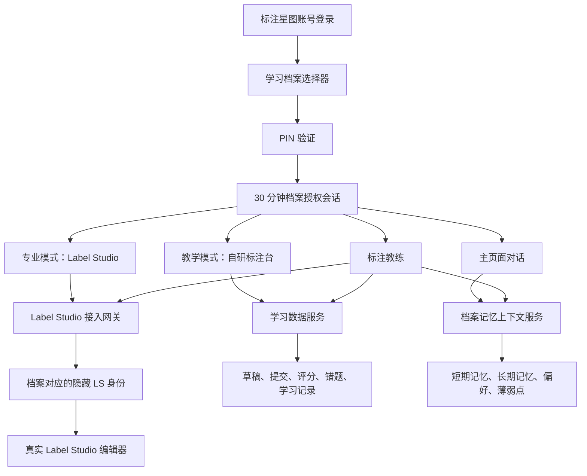

# 学习档案、Label Studio 单点进入与标注教练上下文设计

日期：2026-08-12
状态：已实施；隔离专业模式 E2E 于 2026-08-13 通过

## 1. 背景与目标

标注星图当前已经具备账号认证、按账号隔离的用户工作区、自研图片/文本/音频/视频标注台，以及通过 iframe 打开的 Label Studio 专业模式。当前安装的 Label Studio 服务端版本为 1.23.0；`web/package.json` 中仍有未被业务代码引用的旧依赖 `label-studio-frontend@1.7.1`。专业模式目前只是把 `http://127.0.0.1:8080` 的完整 Label Studio 网站嵌入页面，因此学生仍会遇到 Label Studio 自身的登录体系。

本设计解决四个相互依赖的问题：

1. 一个标注星图账号下允许多个学生使用，并通过独立学习档案隔离数据。
2. 学生只登录标注星图，进入专业模式时不再看到第二个登录页。
3. 保留真实 Label Studio 专业操作体验，并限制学生只能访问被分配的任务。
4. 教学模式和专业模式共用标注教练；教练可在授权范围内读取当前任务、标注状态、历史记录和学习记忆。

本期不做 Label Studio 界面中文化。

## 2. 已确认的产品规则

### 2.1 学习档案

- 一个标注星图账号可拥有多个学习档案，每个档案代表一名学生。
- 每个学习档案拥有独立 PIN。教师或管理员负责创建、重置 PIN；学生验证旧 PIN 后可自行修改。
- PIN 只保存强哈希结果，不保存或返回明文。
- 切换档案必须输入 PIN；连续输错达到限制后暂时冻结。
- 无操作 30 分钟、退出账号、关闭浏览器或手动锁定后，档案会话失效。
- 教师默认以只读方式查看学生档案，不需要学生 PIN。
- 教师如需修改学生数据，必须明确进入“代管模式”，并记录操作者、时间、档案和具体操作。
- 升级时为既有数据自动建立“原有学习档案”，迁移完成后由管理员改名并设置 PIN。

### 2.2 数据归属

公共课程、题库和素材可共用；以下内容必须按学习档案隔离：

- 主页面会话与标注教练会话；
- 长期记忆、学习偏好、薄弱点和待整理问题；
- 学习计划、学习记录、错题和教师评语；
- 标注草稿、提交、评分和同步状态；
- Label Studio 隐藏身份、任务分配及结果映射。

Skill、MCP 和大模型配置默认按标注星图账号共用，不在本设计中改为档案级配置。

### 2.3 双模式标注

- 教学模式保留自研标注台，侧重步骤引导、即时评分、错误讲解和 AI 预标注审阅。
- 专业模式保留真实 Label Studio 操作界面，帮助学生适应市面上的专业工具。
- 专业模式默认直接打开教师分配的当前题目，同时提供“返回本人任务列表”。
- 学生不能访问其他学生的任务，也不能进入组织、用户、项目配置等管理页面。
- 完整 Label Studio 管理入口仅面向教师或管理员。

## 3. 方案选择

### 3.1 被否决的方案

**所有学生共用一个 Label Studio 网页账号。** 改动少，但 Label Studio 内部无法可靠追溯标注者，学生数据也难以隔离。

**只使用服务账号，完全由标注星图模拟标注者。** 学生无需第二次登录，但 Label Studio 中的 annotator 身份失真，完整网页的无感认证和页面限制仍然复杂。

### 3.2 选定方案

采用混合架构：

- 每个学习档案对应独立的 Label Studio 隐藏身份，用于专业模式网页会话和标注者追溯。
- 标注星图服务器持有 Label Studio 服务凭证，用于项目创建、任务导入、结果读取和后台同步。
- 学生浏览器不得接触服务 Token、隐藏账号密码或 PIN 哈希。
- 标注星图维护权威映射：`account_id + learning_profile_id + ls_user_id + ls_project_id + ls_task_id`。
- 标注教练只调用标注星图后端的受控上下文接口，不直接访问 Label Studio Token 或数据库。

Label Studio 社区版的用户创建、细粒度项目权限及 iframe 会话能力必须先做版本 1.23.0 的可行性验证。实现不得直接修改 Label Studio 认证源码。如果独立隐藏身份无法通过稳定接口完成，实施必须停止并向用户报告限制，不得悄悄退化成所有学生共用同一身份。

实施结果：Label Studio 1.23 Community 的组织权限不足以隔离学生，因此最终采用“每档案独立隐藏网页身份 + 每档案独立项目 + 标注星图同源白名单网关”。服务 Token 只用于服务器创建/读取项目与任务，隐藏身份只用于网页标注归属；浏览器看不到两类凭据。隔离 E2E 已验证两个档案互访项目和任务均被网关拒绝。

## 4. 总体架构

### 4.1 模块职责

- **账号认证服务**：确认账号身份、角色及其可管理的学习档案。
- **学习档案服务**：档案 CRUD、PIN 验证、锁定、授权会话和档案切换。
- **学习数据服务**：统一保存两种模式的草稿、提交、评分、错题与同步状态。
- **记忆上下文服务**：构建当前档案的短摘要，并按需检索详细记忆或历史记录。
- **Label Studio 接入网关**：隐藏身份映射、受控会话进入、任务跳转、后台 API 和结果同步。
- **标注教练宿主层**：在教学模式与专业模式上方显示同一教练，管理拖动、展开和上下文绑定。
- **审计服务**：记录管理员查看、代管、PIN 重置、身份映射和关键数据修改。

## 5. 学习档案与安全边界

### 5.1 建议数据对象

- `LearningProfile`：档案 ID、所属账号、显示名、状态、PIN 哈希、创建/更新时间。
- `ProfileGrant`：档案会话 ID、所属账号和档案、授权方式、最后活动时间、过期时间。
- `ProfileAuditEvent`：操作者、目标档案、动作、来源、时间和变更摘要。
- `LabelStudioIdentityMap`：档案与 LS 用户的映射、状态和最后同步时间；不得向前端返回凭证。
- `AnnotationAttempt`：档案、课程、任务、模式、草稿、提交、评分、版本和同步状态。

具体存储实现由实施计划结合现有 PathService 和认证存储决定，但所有业务接口必须使用不可猜测的档案 ID，不得以显示名作为权限键。

### 5.2 授权规则

- 前端传入的档案 ID 只是请求参数，不能作为权限证据。
- 每个档案数据接口必须同时校验账号归属、角色及有效 `ProfileGrant`。
- 学生档案授权采用短期、HttpOnly、SameSite Cookie 或等价的服务端会话；不得仅使用 localStorage 表示“已解锁”。
- 每次有效操作更新最后活动时间；超过 30 分钟无活动后服务端拒绝访问。
- 关闭浏览器触发客户端锁定；即使客户端未触发，服务端过期规则仍是最终保障。
- 教师只读访问不创建学生身份上下文，也不写入学生行为记录。
- 代管模式必须有独立授权标志，所有写操作带入审计来源 `teacher_impersonation`。
- PIN 输错限制、冻结时间和管理员解锁均需服务端实施，不能只在界面控制。

## 6. 双模式标注数据流

### 6.1 教学模式

1. 学生选择公共题目。
2. 后端根据当前档案读取该题的已有草稿。
3. 标注台在关键操作和固定节流窗口内自动保存草稿。
4. 提交后由现有评分能力计算结果并生成学习记录、错题和未确认错误模式。
5. 需要进入专业数据管线时，由同步任务转换格式并写入 Label Studio。

现有 `localStorage` 可暂时作为断网恢复缓存，但不再作为权威数据源。刷新或换设备后以服务端草稿为准，并通过版本号处理冲突。

### 6.2 专业模式

1. 学生选中被分配的专业任务。
2. 网关校验账号、档案授权和任务归属。
3. 网关查找或创建档案的隐藏 LS 身份，并建立受控网页会话。
4. 浏览器直接进入指定任务，不展示第二个登录页。
5. 保存或提交后，网关通过官方 API 读取结果并关联 `learning_profile_id`。
6. 结果进入统一评分、错题、记忆与报告链路。

学生访问路径必须经过网关白名单。对于未分配任务、管理页面、其他项目和其他用户资源，后端应拒绝，而不是只隐藏导航按钮。

### 6.3 同步与异常

- Label Studio 未启动时，专业模式展示可操作的故障说明；教学模式不受影响。
- 创建隐藏身份或会话失败时，不向学生泄露内部账号信息，只返回可重试错误并写入运维日志。
- 标注星图先可靠保存本地记录，再异步同步 Label Studio；失败项进入带退避和幂等键的待同步队列。
- 档案会话即将到期时先保存草稿；过期后停止读写并要求重新输入 PIN。
- 同一提交必须有幂等 ID，重试不得产生重复 annotation。

## 7. 标注教练嵌入与上下文

### 7.1 展示方式

- 教学模式和 Label Studio 专业模式都显示同一个标注教练。
- 教练由标注星图外层页面托管，悬浮在标注区域右下角并可拖动。
- 点击头像后展开侧边对话面板；在空间允许时压缩标注区域，避免遮挡图片、标签栏和保存按钮。
- 教练会话独立于主页面聊天，但二者共享当前档案的长期记忆和学习状态。
- 档案锁定或切换时，旧档案教练会话立即断开并清空页面缓存。

### 7.2 第一阶段默认上下文

- 当前档案和课程的非敏感摘要；
- 当前模式、任务、要求、类别和操作阶段；
- 已保存草稿概况及最近一次提交；
- 最近评分、主要错误和已确认薄弱点；
- 学生偏好的讲解方式；
- 当前教练会话的近期内容。

### 7.3 按需读取工具

当默认摘要不足时，教练可在当前档案范围内读取：

- 指定题目的历史标注和 Label Studio 已保存结果；
- 主页面长期记忆、错题、教师评语和学习计划；
- 能力图谱、待整理问题和相关课程知识库；
- 与当前错误相似的历史案例。

PIN、密码、Token、Cookie、哈希值和其他学生数据不得进入模型上下文。

### 7.4 第二阶段实时桥接

第一阶段只保证读取已保存状态。第二阶段再增加受控事件桥接，向教练提供未保存框数量、当前标签、撤销、切题等最小必要事件。桥接不得把教练逻辑直接写进 Label Studio 源码；优先采用宿主层事件适配或可替换的薄集成层，以降低升级冲突。

### 7.5 记忆写入规则

- 随口提出的问题先进入待整理收集箱。
- 单次错误标记为 `unconfirmed`，重复出现或经学生/教师确认后才成为稳定薄弱点。
- 每条长期记忆保留来源，包括会话、题目、评分或教师确认。
- 教师只读查看不产生学生行为；代管写入必须带教师来源。
- 学生可查看、纠正或删除个人学习偏好与可编辑记忆。

## 8. 迁移设计

迁移必须可重复执行并具备结果报告：

1. 为没有学习档案的既有账号创建“原有学习档案”。
2. 将该账号现有会话、记忆、学习记录、错题和标注记录归属到该档案。
3. 为无法可靠判断归属的数据建立迁移告警，不得静默丢弃。
4. 管理员首次进入时必须为档案设置 PIN，可随后改名。
5. 迁移完成前保留原数据备份；验证计数和抽样内容一致后才切换读取路径。

## 9. 分阶段实施

### 阶段一：学习档案基础

- 档案管理、PIN、冻结、30 分钟授权和锁定；
- 教师只读与有审计的代管模式；
- 现有数据迁移；
- 会话、记忆、学习记录和标注记录的档案隔离。

### 阶段二：专业模式统一进入

- 先验证 Label Studio 1.23.0 的隐藏身份、任务权限和 iframe/会话能力；
- 建立档案与 LS 身份映射；
- 学生无第二次登录，直接进入指定题目和本人任务列表；
- 教师和管理员保留完整管理入口；
- 移除未使用的旧 `label-studio-frontend@1.7.1` 依赖，并验证前端构建。

### 阶段三：数据与教练打通

- 自研标注台服务端草稿；
- 两种模式统一关联档案、评分和学习记录；
- 两种模式共用可拖动教练；
- 教练接入已保存标注、历史、错题和记忆；
- 增加可靠同步队列。

### 阶段四：实时教练与统一工作台

- Label Studio 未保存操作的最小事件桥接；
- 四个独立 HTML 标注台逐步整合为模块化 React 工作台；
- 自动保存、撤销重做、快捷键、缩放和平移；
- 操作方式向 Label Studio 靠近，同时保留教学引导和即时评分。

## 10. 验收标准

- 学生 A 无法通过修改 URL、档案 ID、任务 ID 或接口参数读取学生 B 的任何数据。
- PIN 不以明文保存、记录或返回；连续输错触发服务端冻结。
- 30 分钟无操作后，聊天、记忆、标注和教练的档案接口全部拒绝访问。
- 切换档案后，主对话、教练、记忆、草稿和历史记录同时切换，无旧档案内容残留。
- 教师只读查看不改变学生记录；代管修改拥有完整审计事件。
- 学生进入专业模式不需要再次登录，且只能进入被分配的任务和本人任务列表。
- Label Studio 管理页面和其他学生任务无法通过直接 URL 绕过限制。
- Label Studio 停止运行时教学模式仍可用，专业模式给出明确说明。
- 同步故障不会丢失已完成标注；恢复后重试不生成重复记录。
- 标注教练在两种模式中均可使用，只能读取当前已解锁档案的授权上下文。
- 现有历史数据完整迁入“原有学习档案”，迁移报告中无静默丢失。

## 11. 非目标

- 本期不汉化 Label Studio。
- 本期不让学生管理 Skill、MCP 或大模型凭证。
- 本期不修改 Label Studio 认证源码。
- 第一阶段不要求教练读取 Label Studio 尚未保存的鼠标级实时操作。
- 本设计不替换现有公共题库和课程素材体系。
