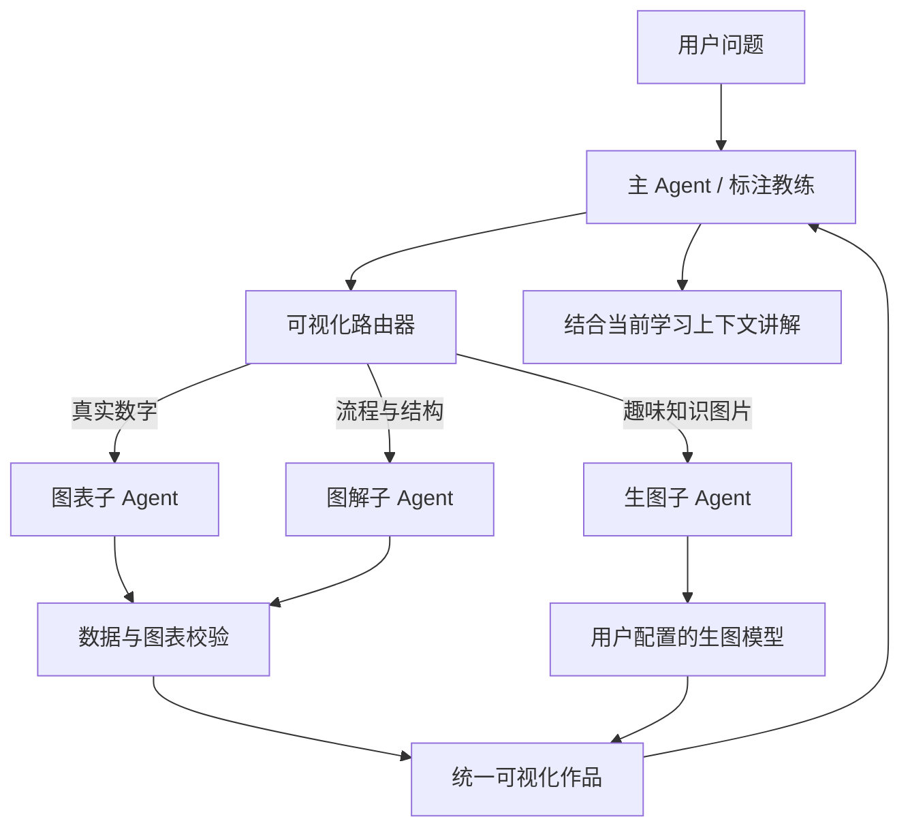

# 生成式可视化与可视化子 Agent 设计

日期：2026-08-13
状态：已由用户逐节确认，待实施计划

## 1. 目标

让主对话、标注教练、知识库问答和学习报告能够根据内容生成可信、可核对、可复用的图表与图解；当用户配置了生图模型时，还可生成趣味知识插画。

系统采用“智能自动 + 用户指定”：模型发现对比、趋势、结构、流程等内容时可自动生成合适的可视化；用户也可明确指定折线图、流程图或知识插画；简单问答不强制生成图。

## 2. 当前基础与问题

项目已有 `render_ui`、Chart.js、Mermaid、SVG、交互 HTML、雷达图、进度卡、知识图和测验卡等能力；仓库还保留功能更重的旧 `visualize` 管道。当前产品只注册 `chat` 主路径，现有能力散落，缺少统一作品协议、真实数据约束、模型路由和通用操作栏。

本设计不恢复整套旧 `visualize` 主流程，而是在 `chat` 中建立共享可视化工具层，并复用已有渲染器。

## 3. 总体架构

主 Agent 负责理解意图、选择表现方式、提供最小必要上下文和最终讲解。子 Agent 专人专事，不继承完整聊天历史或全部学生记忆。

## 4. 共享子 Agent

### 4.1 图表子 Agent

生成柱状图、折线图、对比图、饼图、雷达图、散点图和错误分布图。输入必须包含结构化数据、字段含义、单位和来源。不得填补缺失数字。

### 4.2 图解子 Agent

生成流程图、概念关系图、知识地图、时间线和 SVG 操作示意图。涉及准确关系和文字时，优先使用 Mermaid、SVG 或受控 HTML，不调用生图模型。

### 4.3 生图子 Agent

将主 Agent 的意图整理为提示词，调用当前账号配置的默认生图模型；用户可在单次生成前临时切换其他已配置模型。生图结果标注为“概念示意图”，不能作为精确事实或数字证据。

### 4.4 校验策略

- 简单图表执行确定性 schema、类型、范围和来源校验，不额外调用模型。
- 复杂作品才调用可视化检查步骤，核对数据、标签、单位和图形是否一致。
- 子 Agent 超时或失败不阻止主回答；系统保留文字回答，并可降级为流程图或 SVG。

## 5. 真实性硬规则

- 所有数字图表只能使用真实数据，不能为美观编造数值。
- 每张数字图表保存原始数据、来源、更新时间、单位、图表类型和校验状态。
- 数据不足时必须说明缺少什么；可改用不带虚假数字的流程图、概念图或示意图。
- 知识库问答产生的关系图保留来源引用。
- 学习报告只复用通过校验的图表，不自动使用趣味插画。
- 生图中的文字、复杂关系和细节不作为教学事实；准确标签应由前端覆盖层或 SVG 生成。

## 6. 统一作品协议

`VisualizationArtifact` 至少包含：

- `id`、`profile_id`、`session_id`、创建时间；
- `kind`：`chart | diagram | generated_image`；
- 标题、说明和无障碍替代文本；
- 渲染协议及内容；
- 原始数据或生图提示词；
- 数据来源与更新时间；
- 生成模型与临时模型选择；
- 校验状态与失败原因；
- 保存状态：会话作品、学习资料或已删除。

现有 scorecard、radar、progress、graph、quiz_card 逐步适配统一协议，迁移期间保留兼容解析。

## 7. 路由规则

- 有真实数值并需要比较、趋势或分布：图表。
- 表达结构、步骤、因果、时间顺序或知识关系：图解。
- 表达抽象比喻、场景故事或趣味概念：生图。
- 用户明确指定形式时优先遵从，但若形式会造成事实误导，系统应说明并建议替代形式。
- 用户没有配置生图模型时，显示配置引导，不使用平台内部模型代替，也不伪造结果。
- 图表和图解不依赖生图模型，仍可正常工作。

## 8. 产品接入范围

- **主对话**：完整支持图表、图解、生图和交互图。
- **标注教练**：支持标注结果对比、成绩趋势、错误分布、操作示意和知识插画，由教练主 Agent 调度。
- **知识库问答**：支持概念关系图并保留引用。
- **学习报告**：只调用经过校验的图表与图解。

底层子 Agent 为全系统共享能力，不要求用户安装 Codex、Claude Code 等外部子 Agent。

## 9. 前端体验

作品在对话中直接显示，并支持：

- 全屏查看；
- 下载 PNG；
- 查看原始数据、单位和来源；
- “换一种图”；
- 生图前临时切换已配置模型；
- 保存为当前学习档案的会话作品；
- 加入学习资料或删除。

界面显示“正在整理数据—正在绘制—正在核对”等简短进度，详细执行日志默认折叠，不展示模型内部思考。

对话生成图片不自动写入长期记忆。作品保存生成模型、时间和原始提示词，供用户追溯。

## 10. 性能与安全

- 可视化组件按需加载，避免增加主页面首屏负担。
- 简单回答不启动子 Agent；简单图表不进行额外模型评审。
- 主 Agent 只向子 Agent提供完成任务所需的数据。
- 子 Agent 不读取 PIN、Token、全部记忆或其他学习档案数据。
- 生图费用和模型选择由用户配置决定，不暗中调用 Image2。

## 11. 验收标准

- 用户询问真实学习趋势时可以获得折线图，并查看相同原始数据和来源。
- 数据不足时系统不生成虚假数值图表。
- 同一作品可在主对话、标注教练和报告组件中复用。
- “换一种图”不改变原始数据，仅改变合法表现形式。
- 未配置生图模型时提供明确引导，图表和流程图仍可生成。
- 子 Agent 失败不导致主回答失败。
- 大型图表组件不会进入首屏主包或明显拖慢普通聊天。

## 12. 非目标

- 固定标注教练品牌形象的 Image2 生成属于独立设计，不由用户模型配置控制。
- 本期不恢复旧版完整 `visualize` capability。
- 本期不向学生展示子 Agent 的内部推理文本。
