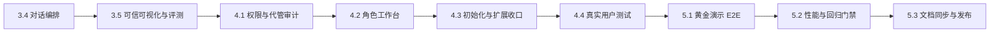

# 标注星图竞赛优化设计总索引

日期：2026-08-14

状态：交接基线

适用分支：`main`
代码基线：`1abf9e7e feat: 统一知识库混合检索与引用`

## 1. 文档用途

本文件是本轮竞赛纵向优化的唯一导航页。接手的 AI 应先阅读本文件，再按任务读取对应专项规格，不得只根据聊天记录猜测需求。

## 2. 事实来源与优先级

出现冲突时按下列顺序处理：

1. 已合并代码、自动化测试与当前数据库结构代表“系统现在实际能做什么”。
2. 本索引列出的专项规格代表“接下来必须实现成什么样”。
3. `2026-08-13-competition-readiness-vertical-optimization-design.md` 代表产品目标、范围和非目标。
4. `../plans/2026-08-14-competition-readiness-vertical-optimization-implementation.md` 代表推荐实施顺序和文件清单。
5. 更早的专项设计仅提供背景；若与本轮规格冲突，以本轮规格为准。

代码与设计不一致时，不得把未完成能力写成已经可用。先在交付说明中标记差距，再按专项规格实现并验证。

## 3. 不可改变的产品决策

- 保留 Next.js、FastAPI 和 Label Studio，不拆微服务，不引入 Redis 或消息队列。
- 学生只登录标注星图；Label Studio 完整管理页仅供管理员内部使用。
- 同时保留“教学模式”和“专业模式”，二者共享任务、正式结果、评分、记忆和教练上下文。
- 学生一级入口固定为“学习、实训、成长、我的”；技术配置不暴露给学生。
- 教材、题库、评分规则和规范只能由管理员审核发布；AI 只能生成候选内容。
- 数字图表只能使用服务端可信数据集；不得由模型补数、改数或用文字来源冒充真实引用。
- 教师默认只读，代管必须有理由、限时、留痕，且不能修改原始证据。
- 竞赛主路径固定为交通道路矩形框任务，目标演示时长 5 至 7 分钟。
- 外部模型、Embedding 或 Label Studio 不可用时必须明确降级，不得用预置结果冒充实时能力。

## 4. 已完成基线

| 能力 | 状态 | 代码提交 |
|---|---|---|
| 统一当前学习任务 | 已完成 | `1819bb0b`、`312a1167` |
| 学生四入口与首页收敛 | 已完成 | `8fc3d05d` |
| 首页与成长页聚合加载 | 已完成 | `8df87438` |
| 教学/专业模式编辑权隔离 | 已完成 | `c4cc1e6b` |
| 矩形框移动、缩放、换标签等核心交互 | 已完成 | `ecec8d61` |
| 草稿、正式提交与修订版本 | 已完成 | `21b8e611` |
| 教练评分与订正闭环 | 已完成 | `5bde6619` |
| Windows 解析路径修复 | 已完成 | `d72de070` |
| 教材转 Markdown 与结构化导入 | 已完成 | `7a633fde` |
| 受限教材解析子 Agent | 已完成 | `b0e73cb2` |
| 混合检索与真实引用卡片 | 已完成 | `1abf9e7e` |

“已完成”只表示代码和既有自动化测试通过，不等于外部服务已经配置。尤其是 Embedding、生图模型和 Label Studio，必须在目标电脑上完成真实连接测试后才能标记为“就绪”。

## 5. 剩余设计文件

| 顺序 | 专项规格 | 对应任务 |
|---|---|---|
| 1 | `2026-08-14-deterministic-dialogue-progressive-answer-design.md` | 3.4 确定性对话编排与渐进回答 |
| 2 | `2026-08-14-trusted-visualization-evaluation-design.md` | 3.5 可信可视化与大模型评测 |
| 3 | `2026-08-14-profile-authorization-impersonation-audit-design.md` | 4.1 统一账号角色、档案权限与代管审计 |
| 4 | `2026-08-14-role-workspaces-onboarding-extension-design.md` | 4.2 管理员/教师工作台；4.3 初始化与白名单扩展 |
| 5 | `2026-08-14-user-testing-competition-evidence-design.md` | 4.4 真实用户测试与竞赛证据 |
| 6 | `2026-08-14-release-readiness-gates-design.md` | 5.1 至 5.3 黄金演示、性能、发布文档 |
| 7 | `../handoffs/2026-08-14-competition-optimization-ai-handoff.md` | 跨 AI 执行顺序、边界和交付模板 |

## 6. 执行顺序

4.1 必须先于角色工作台和扩展市场，因为前端隐藏入口不能替代后端授权。真实用户测试必须在核心权限、主路径和降级行为稳定后进行，避免测试数据失真。

## 7. 全局完成定义

只有以下条件同时成立，才可宣布本轮完成：

1. 交通道路诊断、学习、矩形框标注、评分、订正、成长报告全链路稳定。
2. 对话、检索、图表和报告均能追溯到真实记录或已审核内容。
3. 学生、教师、管理员及代管访问的 REST、WebSocket、Agent 工具和 Store 权限矩阵通过。
4. 外部服务故障可以取消、重试或降级，且不重复写入。
5. 2 名学生与 1 名职教教师完成两轮真实测试，报告数字能回查原始记录。
6. 普通竞赛电脑达到性能预算，5 至 7 分钟黄金演示至少连续通过三次。
7. AGENTS.md、演示文档、已知限制和实际产品完全一致。
