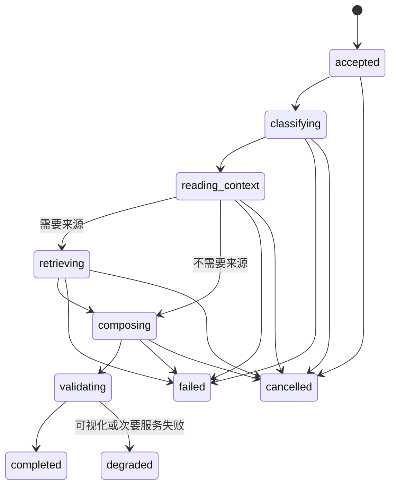

# 确定性对话编排与渐进回答设计

日期：2026-08-14

状态：已批准，待实现
对应任务：竞赛纵向优化 3.4

## 1. 目标

把“应该查什么、能调用几次工具、何时记录、何时推进任务、超时如何退出”从提示词迁入后端策略。大模型只负责理解学生表达和生成教学语言，不再承担关键业务控制。

学生发送消息后应立即看到真实进度，先获得简短可操作的核心答案，再按需展开解释、引用和可视化。

## 2. 非目标

- 不替换现有模型供应商或流式通信协议。
- 不把所有教学内容写成固定回复。
- 不在本任务中重做知识库、评分器或标注台。
- 不允许用虚假“正在检索”等动画掩盖后端无事件。

## 3. 当前问题

现有 `agentic_pipeline.py` 同时承担意图推断、工具选择、提示词拼装、循环控制和结果输出。流程过度依赖模型遵守提示，可能出现重复检索、重复写入、无效工具循环、等待时间过长及前端状态与真实执行不一致。

## 4. 核心模型

新增 `TeachingRunPolicy`，每次请求开始时由服务端生成且运行中不可由模型扩大权限：

```python
class TeachingRunPolicy:
    intent: str
    profile_id: str
    current_task_id: str | None
    allowed_tools: tuple[str, ...]
    max_tool_calls: int
    max_retrieval_calls: int
    soft_timeout_ms: int
    hard_timeout_ms: int
    may_write_learning_record: bool
    required_source_level: str | None
    answer_contract: str
```

新增 `TeachingRunState` 记录 `run_id`、阶段、已用预算、取消标记、幂等键、工具结果引用和最终写入结果。它是执行事实，不由聊天消息文本反推。

## 5. 意图与预算

| 意图 | 可读数据 | 工具预算 | 写入规则 |
|---|---|---|---|
| 普通理论问答 | 当前任务、一次混合检索 | 最多 1 次检索、2 次工具 | 默认不写学习事实 |
| 模糊需求澄清 | 当前任务摘要 | 不检索或最多 1 次 | 只在学生确认后更新目标 |
| 当前标注求助 | 当前任务、当前草稿、历史错误、一次检索 | 最多 4 次工具 | 不改变正式标注 |
| 提交后解释 | 正式提交、评分结果、规则引用 | 最多 3 次工具 | 只追加解释记录 |
| 订正引导 | 修订链、错误项、当前编辑权 | 最多 3 次工具 | 由确定性接口创建修订 |
| 学习报告 | 服务端聚合数据集 | 最多 2 次工具 | 不允许模型自填数字 |
| 规范/阈值/安全 | 已审核来源 | 最多 1 次检索 | 无可靠来源时拒绝强答 |

默认软超时 15 秒：先返回核心答案或可继续状态；硬超时 30 秒：停止新工具调用并允许重试。长任务必须显式转为可取消后台任务，不得无限占用聊天连接。

## 6. 状态机与事件



后端流式事件统一为：`run.accepted`、`intent.resolved`、`context.loaded`、`retrieval.started/completed`、`tool.started/completed`、`answer.core`、`answer.detail`、`artifact.ready`、`run.completed/degraded/failed/cancelled`。每个事件包含 `run_id`、顺序号、真实时间和可公开阶段；管理员诊断字段不得发送给学生。

取消接口设置服务端取消令牌；后续工具必须检查令牌。重试产生新 `run_id`，但继承原请求的业务幂等键，已经成功的学习记录不得重复写入。

## 7. 渐进回答合同

最终回答使用结构化对象，而不是要求前端解析自然语言标题：

```json
{
  "summary": "一句话结论",
  "next_action": "学生现在要做的一个动作",
  "reasons": ["最多三个关键原因"],
  "details": [{"title": "可展开标题", "markdown": "详细解释"}],
  "citations": ["citation_id"],
  "artifact_ids": ["artifact_id"],
  "uncertainty": null
}
```

规范、阈值和安全结论没有已审核引用时，`uncertainty` 必须说明“当前资料中没有可靠依据”，并给出向教师确认或查看来源的下一步。不得用模型记忆补齐。

前端 `ResponseProgress` 只显示收到的真实事件；核心答案到达后即可阅读，详情与作品后到不阻塞核心文本。失败提示必须说明内容是否已保存、可否重试及是否影响正式提交。

## 8. 确定性写入边界

- 诊断得分、正式提交、评分、修订创建、阶段推进均调用现有业务服务，由服务端校验状态和幂等键。
- 模型不能直接决定“学生已掌握”或修改正式成绩；只能生成建议。
- 写学习记录前再次执行档案权限策略，教师只读和代管限制不得由编排器绕过。
- 工具返回内容只以引用 ID 进入上下文，大对象不重复塞入提示词。

## 9. 文件边界

新增：

- `deeptutor/services/teaching_orchestration/models.py`
- `deeptutor/services/teaching_orchestration/policy.py`
- `deeptutor/services/teaching_orchestration/budgets.py`
- `tests/services/test_teaching_orchestration.py`
- `web/components/chat/home/ResponseProgress.tsx`
- `web/tests/response-progress.test.ts`

修改：

- `deeptutor/agents/chat/agentic_pipeline.py`：变为策略执行器，不再自行扩大工具集。
- 标注教练 persona 与 decision matrix：删除业务状态写入职责，保留教学语气。
- 主对话页面与 `ChatMessages.tsx`：消费结构化回答和真实事件。

## 10. 失败与降级

- 检索失败：可以回答不依赖规范的操作性常识，但必须标记未完成来源核验。
- 可视化失败：正文继续，显示“图解生成失败，可重试”，不能使整回合失败。
- 模型超时：保留已收到的核心答案；没有核心答案则显示可重试状态。
- 档案或任务版本冲突：停止写入并要求刷新，不把旧结果写入新档案。
- WebSocket 断开：运行可被服务端取消；恢复后按 `run_id` 查询最终状态，不重复执行。

## 11. 验收

自动测试至少覆盖：意图到工具白名单映射、普通问答只检索一次、标注求助预算、规范无来源拒绝、取消、硬超时、重试幂等、切档隔离、教师只读、事件顺序和渐进回答字段。

执行：

```powershell
python -m pytest tests/services/test_teaching_orchestration.py tests/core/test_agentic_labels.py -q
cd web
node --test tests/response-progress.test.ts
```

人工验收：慢速模型下点击发送 300 毫秒内出现真实状态；普通问答不超过一次检索；取消后无额外学习记录；规范无来源时不强答；核心答案可先于图表显示。

## 12. 完成定义

只有后端预算实际限制工具、关键状态由业务服务推进、前端状态来自真实事件、取消与幂等通过测试，才算完成。仅修改提示词或增加加载动画不算完成。
