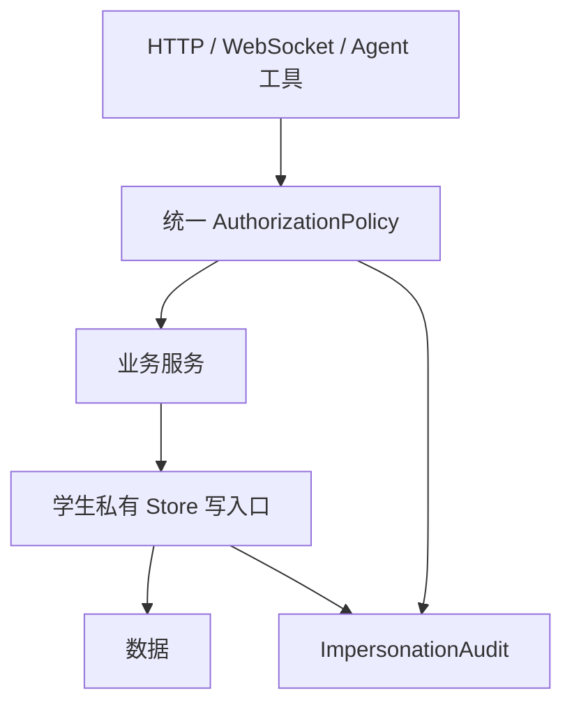

# 统一角色权限、学习档案隔离与代管审计设计

日期：2026-08-14

状态：已批准，待实现
对应任务：竞赛纵向优化 4.1

## 1. 目标

建立一套在路由、WebSocket、Agent 工具和 Store 层一致执行的授权策略。一个账号可有多个学生学习档案；教师只访问被授予的档案；管理员管理系统但不能绕过原始学习证据保护。代管行为必须限时、有理由、逐次留痕。

## 2. 权限模型

系统入口由账号角色控制，具体学生数据由档案 Grant 控制：

- `student`：仅使用当前账号内自己可解锁的学习档案。
- `teacher`：默认只读被分配档案；可进入受限代管模式。
- `admin`：管理内容、AI、集成和系统；查看学生数据仍需明确业务权限和审计。

Grant 至少包含 `account_id`、`profile_id`、`role`、`scopes`、`created_by`、有效期和撤销时间。所有缓存键和查询条件必须包含账号与档案，不以客户端传入的 profile ID 作为授权依据。

## 3. 操作矩阵

| 操作 | 学生本人 | 教师只读 | 教师代管 | 管理员 |
|---|---:|---:|---:|---:|
| 查看当前任务、报告、问题 | 是 | 已分配档案 | 是 | 按授权 |
| 发送学生对话 | 是 | 否 | 否 | 否 |
| 修改原始记忆/对话 | 受业务规则限制 | 否 | 否 | 否 |
| 提交或改写原始标注 | 是 | 否 | 否 | 否 |
| 修改初次成绩 | 否 | 否 | 否 | 否 |
| 分配学习任务 | 否 | 否 | 是 | 是 |
| 整理收集箱问题 | 是 | 否 | 是 | 是 |
| 添加教师反馈 | 否 | 否 | 是 | 是 |
| 修正已审核派生记录 | 否 | 否 | 是 | 是 |
| 修改 PIN | 学生经验证 | 否 | 否 | 走重置流程 |
| 删除原始证据 | 否 | 否 | 否 | 仅依法依规的数据删除流程 |

“原始证据”包括原始对话、标注提交、初次成绩、测试原始记录和审计日志。纠错通过追加修订版本实现，不覆盖原值。

## 4. 代管会话

教师启动代管必须选择被分配档案、填写非空理由并再次验证身份。会话包含 `impersonation_id`、教师、档案、理由、允许 scope、开始/最后活动/到期时间。无操作 30 分钟自动失效；退出账号、撤销 Grant 或管理员终止时立即失效。

每次代管写操作必须生成审计事件，记录请求 ID、教师、档案、动作、理由、资源类型与 ID、修改前后摘要、时间和结果。敏感正文使用哈希或最小必要摘要，审计日志本身不可由教师修改。

## 5. 强制执行位置



路由门禁负责尽早拒绝，Store 门禁负责最后防线。任何新工具绕过路由直接写 Store 时仍必须被拒绝。需审计的现有范围包括聊天与会话、学习记录、记忆、收集箱、反思、题本、掌握路径、笔记、扩展状态、可视化作品、标注和 Label Studio 网关。

Agent 工具执行时从受信请求上下文获取主体和档案，不允许模型参数自行声明身份。后台任务保存授权快照并在真正写入前重新校验有效性。

## 6. API 与错误

- 401：未登录或会话失效。
- 403：角色或档案 Grant 不允许，返回稳定错误码，不泄露目标档案是否存在。
- 409：版本冲突或原始证据不可覆盖。
- 423：PIN 锁定或代管已过期。

前端可以隐藏无权入口，但后端必须独立拒绝直接 URL、伪造请求和 WebSocket 消息。错误提示面向学生/教师说明下一步，管理员诊断中保留脱敏 request ID。

## 7. 兼容与迁移

历史数据归入“原有学习档案”，保留原 ID 映射。缺少主体上下文的旧写入口先改为显式拒绝，不允许为了兼容默认使用第一个档案。迁移脚本必须可重复执行并输出数量校验，不删除未知记录。

## 8. 文件与测试

新增统一 `authorization/policy.py`、`authorization/impersonation.py` 与安全矩阵测试；修改 learning profile grants/audit/auth 和所有学生私有 Store 写入口。

测试按 REST、WebSocket、Agent 工具、后台任务、Store 直调五条通道覆盖每种角色，至少验证：跨档案读写、教师只读、代管允许/禁止项、30 分钟过期、撤销 Grant、每次写审计、原始证据不可改、重试不重复审计。

```powershell
python -m pytest tests/security/test_role_permission_matrix.py tests/security/test_impersonation_write_audit.py tests/security/test_learning_profile_isolation_matrix.py -q
```

## 9. 完成定义

只有所有私有数据写入口都经过同一策略、教师只读无法通过任何通道写入、代管每次修改可追溯且原始证据不可覆盖，才算完成。仅在前端隐藏按钮或只给部分路由加 guard 不算完成。
