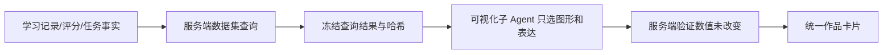

# 可信可视化、生成图片与大模型评测设计

日期：2026-08-14

状态：已批准，待实现
对应任务：竞赛纵向优化 3.5

## 1. 目标

让主对话、标注教练、知识问答和学习报告共享一种可追溯作品协议，支持柱状图、折线图、对比图、雷达图、流程图、概念图、SVG 图解和生成图片。数字作品必须绑定服务端事实；生成图片必须记录模型、提示词与安全信息。

同时建立 30 至 50 条固定案例，持续检查准确性、易懂程度、可操作性、引用、工具预算、权限隔离和降级行为。

## 2. 当前基线与必须修复的差距

现有 `VisualizationArtifact`、`ChatChartCard` 和图表/流程图子 Agent 可以继续使用，但实施前必须验证并修复：

1. 标注教练完成事件不得清空本回合作品；作品必须与消息和会话绑定并可恢复。
2. 学习报告需要消费统一作品协议，不能长期维护另一套不可追溯图表。
3. 作品操作补齐 PNG 下载、换图、保存、加入学习资料和删除；不能只有 JSON 下载。
4. `imagegen` 结果封装为 `generated_image`，记录模型配置引用、提示词、来源和保存状态。
5. 生图允许从管理员已配置且授权的模型中临时选择，但学生不能填写密钥或任意服务地址。
6. 教练状态形象接入统一状态机；母图存在不等于思考、鼓励、提醒、成功、错误状态已完成。
7. 数字真实性改为服务端 `dataset_ref + version + query + unit + hash`，不能只校验模型填写的 `source` 文本。

## 3. 统一作品模型

```json
{
  "artifact_id": "va_...",
  "profile_id": "profile_...",
  "session_id": "session_...",
  "message_id": "message_...",
  "type": "chart|diagram|generated_image",
  "title": "本周错标类型对比",
  "spec": {},
  "dataset_ref": {
    "dataset_id": "learning_metrics:...",
    "version": 3,
    "query": {"range": "2026-08-01/2026-08-14"},
    "unit": "次",
    "sha256": "..."
  },
  "generation": {
    "model_profile_id": null,
    "model_id": null,
    "prompt": null
  },
  "save_state": "ephemeral|saved|learning_material",
  "created_at": "ISO-8601"
}
```

`chart` 必须带 `dataset_ref`；`diagram` 可绑定教材引用或当前任务；`generated_image` 必须带生成模型和提示词，但不得记录密钥。所有读取、保存、删除、换图都校验当前档案。

## 4. 可信数据流程



模型只能收到已冻结的数据与字段解释，不能新增数据点。换一种图只允许修改图形类型、颜色、排序和说明；服务端再次计算哈希，数据变化立即拒绝。没有单位、版本或数据集 ID 的数字图不得渲染为可信作品。

## 5. 子 Agent 分工

- 主标注教练：判断是否需要作品、选择专家、汇总正文，不直接画图或调用任意外部模型。
- 图表专家：只基于冻结数据选择图表类型和展示编码。
- 图解专家：把已审核知识或步骤转成流程图、概念图或 SVG。
- 插图专家：只生成安全、适龄、明确用途的提示词，由主 Agent 调用已授权 imagegen。

三名专家必须进入统一专家清单和前端目录，但学生只看到“正在生成图表/图解/插图”，不暴露内部代理术语。

## 6. 作品操作与 API

至少提供：

- `GET /visualization-artifacts/{id}`：读取作品与可公开来源。
- `GET /visualization-artifacts/{id}/source`：按角色返回来源；学生看名称、范围和单位，管理员可看哈希与查询。
- `POST /visualization-artifacts/{id}/rerender`：在不改数据的前提下换图。
- `POST /visualization-artifacts/{id}/save`：保存到会话作品。
- `POST /visualization-artifacts/{id}/learning-material`：加入当前档案学习资料。
- `DELETE /visualization-artifacts/{id}`：删除用户保存副本，不删除底层学习事实。
- `GET /visualization-artifacts/{id}/export?format=png|svg|json`：受控导出。

前端卡片统一提供“查看来源、全屏、下载、换一种图、保存、加入学习资料、删除”。按钮按作品类型和权限显示；生成图片不显示原始数据，数字图不允许脱离来源导出为“可信报告”而丢失出处。

## 7. 生图模型与教练形象

生图使用用户所属环境中管理员已配置的 provider。支持的实际厂商以运行时代码和连接测试为准；没有可用模型时明确提示配置缺失，不使用假图冒充实时生成。

单次选择只传 `model_profile_id`，服务端验证该配置已启用、属于当前账号可用范围且类型为 imagegen。Azure、OpenAI-compatible 等适配器必须使用各自实际契约测试，不能假定所有厂商响应完全相同。

“星轨机器人·软萌 3D”母图继续作为品牌基准。衍生状态为默认、思考、鼓励、提醒、成功、错误；保持轮廓、配色和透明背景一致。UI 根据真实运行状态切换，错误状态不用于普通答错，避免制造压力。

## 8. 评测集

固定 40 条作为默认规模：交通道路 14 条、工厂质检 9 条、校园监控 8 条、商超货架 9 条。覆盖理论、模糊提问、当前步骤求助、标注订正、规范引用、无可靠来源、学习报告、可信图表、超时取消、跨档案和教师只读。

每条案例包含输入、角色、档案、当前任务快照、允许来源、预期意图、工具上限、时间预算、必须出现/禁止出现、引用要求、数据集要求及人工评分提示。测试数据必须匿名且可重放。

自动检查：

- 是否超过工具/检索预算；
- 是否使用了允许的真实引用；
- 数字图是否绑定数据集、版本、单位和哈希；
- 换图前后数据哈希是否一致；
- 是否跨档案读取或写入；
- 无来源时是否编造规范或阈值；
- 超时/取消是否产生重复记录；
- 回答合同字段和作品状态是否完整。

人工采用 1 至 5 分，评价专业准确、容易理解、能够操作、教学帮助四项，并记录严重错误。自动评分模型只能辅助归类，不能替代人工专业审核。

## 9. 文件边界

新增：

- `tests/evals/annotation_coach_cases.json`
- `tests/evals/test_annotation_coach_eval.py`
- `scripts/run_annotation_coach_eval.py`
- `docs/evaluation/annotation-coach-eval-method.md`

修改范围包括 `visualization_artifacts` 模型与 Store、图表数据工具、作品工具、统一作品卡片、标注教练、学习报告、生图工具、专家清单和教练状态资源。不得在该任务中重构无关页面。

## 10. 验收

```powershell
python -m pytest tests/evals/test_annotation_coach_eval.py tests/tools/test_visualization_artifact_tool.py -q
python scripts/run_annotation_coach_eval.py --offline-contracts
cd web
npm run test:node
```

人工验收至少包括：刷新页面后教练作品仍存在；学习报告可查看真实来源；同一数据切换柱状图与折线图数值不变；跨档案作品不可见；缺少生图配置时明确失败；完成/错误状态正确切换；PNG、全屏、保存、加入资料和删除按权限工作。

## 11. 完成定义

统一协议被四个入口实际消费、数字图绑定服务端事实、生成图片可追溯、作品生命周期完整、40 条评测可重复运行，才算完成。仅增加图表样式、提示词或一张教练图片不算完成。
